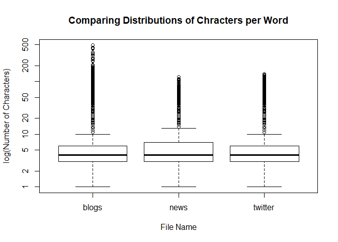
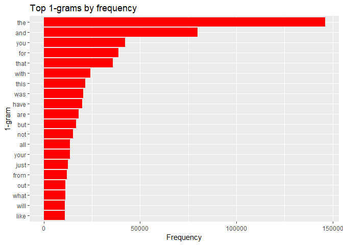
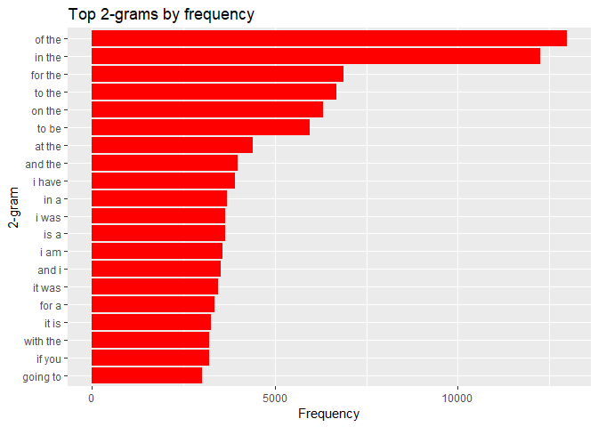
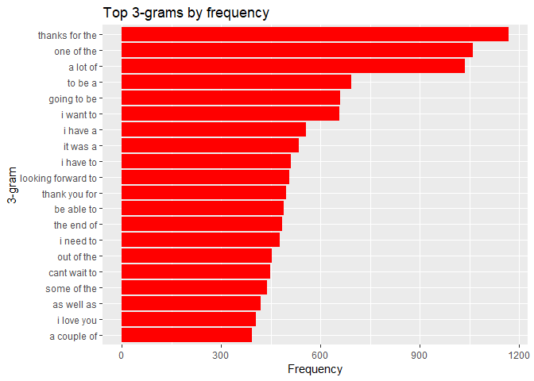
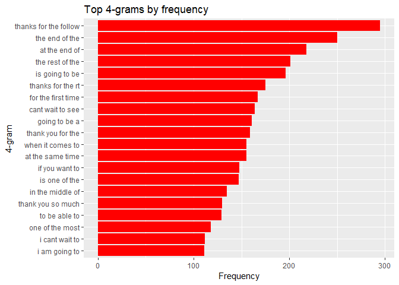

# Introduction

The objective of this project is to show the exploratory analysis to the data and the objectives to develop an application and prediction algorithm.


# Loading Data


Making a first approximation, we observe documents with a considerably large size (150 - 200 MB) and around 35 million words to be processed per document. 


```
        size (MB)   lines    words     chars
blogs    200.4242  899288 37334131 206824505
news     196.2775 1010242 34372530 203223159
twitter  159.3641 2360148 30373583 162096241
```

<!-- -->

According to the boxplot the three documents have a similar amount of characters per word. In addition there is a large number of words outside the limits, we will explore this.

To evaluate what is involved, we will consider the first 3 words longer than 20 for each document (blogs, news and twitter respectively).


```
 [1] "democratically-minded"                                                                                                
 [2] "memory—comparatively."                                                                                                
 [3] "HAHAHAHAHAHAHAHAHAHAHAHAHAHHAHAHAHAHAHAHAHAHAHAHHAHAHAHAHAHAHAHAHAHAAHHAHA"                                           
 [4] "something-for-nothing"                                                                                                
 [5] "DunLaoghaire-Rathdown"                                                                                                
 [6] "location--Minneapolis,"                                                                                               
 [7] "http://www.yogajournal.com/for_teachers/697?utm_source=DailyInsight&utm_medium=newsletter&utm_campaign=DailyInsight)."
 [8] "-http://deckboss.blogspot.ca/2012/05/legislature-lavishes-aquaculture.html"                                           
 [9] "hacker/cyberterrorist"                                                                                                
[10] "(Esshaych@hotmail.co.uk),"                                                                                            
```

```
 [1] "theCareerBuilder.comad"     "tetrahydrocannabinol,"     
 [3] "therndon@stonepointcc.org." "National-Bedminster’s"     
 [5] "chandleraz.gov/cinco."      "(healthoregon.org/radon)." 
 [7] "portlandbicycletours.com."  "greyhoundwelfare.org."     
 [9] "http://www.nikkics.com."    "http://www.mattdennys.com."
```

```
 [1] "djsosnekspqnslanskam."           "foundations/charities,"         
 [3] "evening/afternoon/whatever"      "#OneThingYouShouldntDo"         
 [5] "Sark-oh-no-he-didn'tzy,"         "Liberals/Progressives/DemoRates"
 [7] "after-work.Introducing"          "#problemchildontheloose"        
 [9] "#WordsYouWillNeverHearMeSay"     "www.historyglobe.com/jamestown/"
```

According to the summary seen, the "words" that have relationship with websites, emails, expressions that do not represent words and hashtag of twitter.

On the other hand, words appear that are not separated by space, but by slash or line, these should be considered as valid in cleaning.

# Text transformation and cleaning

Due to the size of the documents a corpus is made considering a sample of 5% of each document.


Then transformations are made to structure the data, according to the following:

- Remove punctuation and junk
- Replace Unicode apostrophe with ASCII apostrophe
- Remove multiple repeating consecutive words
- Remove multiple repeating consecutive pairs of words
- Remove profane words
- Replace abbreviation
- Replace contraction
- Remove numbers
- Transform to tolower
- Remove punctuation
- Remove strip extra whitespace

To remove the profane words a dictionary of the GitHub account was used. [Robert J Gabriel.](https://github.com/RobertJGabriel/Google-profanity-words/blob/master/list.txt)

Next, the resulting document-term matrix is displayed.


```
<<TermDocumentMatrix (terms: 124333, documents: 3)>>
Non-/sparse entries: 168191/204808
Sparsity           : 55%
Maximal term length: 261
Weighting          : term frequency (tf)
Sample             :
      Docs
Terms  en_US.blogs.txt en_US.news.txt en_US.twitter.txt
  and            54596           3436             21801
  are             9676            559              7974
  for            18139           1434             19345
  have           11046            564              8287
  that           23000           1303             11609
  the            91604           7718             46658
  this           13076            465              8061
  was            13750            862              5882
  with           14192           1073              8819
  you            14852            348             27092
```

# Build n-Grams

To determine the behavior of the term frequency of the document-term matrix, four n-grams are created.

Next, a summary is displayed with the number of terms for each n-gram.


```
      1-gram    2-gram     3-gram     4-gram   
Terms "124333"  "1233860"  "2611491"  "3233189"
size  "10.8 Mb" "108.8 Mb" "241.8 Mb" "318 Mb" 
```

A large number of terms is observed for each n-gram, which may slow down the execution of the model.


Below are the 20 terms most frequently for each n-gram.

<!-- --><!-- --><!-- --><!-- -->

The following shows how many unique words you need in a dictionary ordered by frequency to cover 50% and 90% of all instances of words in the language.


```
        1-gram 2-gram  3-gram  4-gram
Cov 50%    262  36390  896745 1518444
Cov 90%  10057 890911 2268542 2890240
```

To make the number of terms more manageable, scattered words will be eliminated considering a factor of 20%.

Below is a summary with the number of terms for each n-gram.


```
      1-gram   2-gram   3-gram   4-gram  
Terms "11835"  "25342"  "10244"  "1679"  
size  "1.3 Mb" "2.9 Mb" "1.2 Mb" "0.2 Mb"
```

As noted, the terms for each n-gram have decreased considerably.


```
        1-gram 2-gram 3-gram 4-gram
Cov 50%    157   1095   1078    231
Cov 90%   3033  10269   5845   1106
```


Performing the same analysis for the new n-gram, a large decrease in terms is also observed. This must be reviewed in conjunction with the predictive capacity of the model to be performed.


# Conclusions

The words in the documents have a similar number of letters in average, the same happens with their deviation. There are words outside this range, mainly due to references of web pages, emails, twitter hashtag and misspelled words. At a general level, these terms are not useful for analysis and are mostly eliminated during cleaning.

To create the corpus it was necessary to select a set of 5% of the total of each document, this is because it is inefficient to manage such a large corpus in a personal computer. This can cause problems for the model, since terms that are relevant may be left out.

For this problem I plan to make several sub-corpus (by means of a random sample with replacement) that are computationally manageable, create the document-term matrix for each one and merge them. This will help the terms with intermediate frequencies that are relevant not be lost, although at the expense of processing time. This will be the training set of the model that represents 60% of the corpus. The set of tests will be 20% and the validation 20%.

In the document-term matrix it is observed that the terms with more frequency are stopwords, which was evident, since to articulate sentences are used a lot. They were not eliminated during the cleanup on purpose, because the goal is to predict words, so normally predictions must appear.

When creating the n-grams I had problems with the **gdap** library, it took a long time to execute (do not delve into the reasons), so I chose to use the **NLP** library that gave better results. With this I want to indicate that the algorithms used are relevant to the application and that it will be necessary to optimize them, improving the development of what is already done as looking for other packages in R that may be useful, such as **quanteda** and **tidytext**.

Another important point to note is the size of the n-grams. The memory usage is considerable, which can cause problems in devices with low available memory. This will be verified during the development of the model and subsequent implementation of the Shiny application. In case of generating problems I plan to treat it by removing the sparse words, as shown in the document, adjusting the factor of terms to be eliminated according to the performance of the model, we must make a trade-off between the computational performance and the quality of the prediction.

To detect words that are in another language, use the **hunspell** package and the default dictionary for this package. It has the main problem that it is necessary to adjust the terms to their conditions so that it filters, structure that I could not find. On the other hand, the dictionary is deficient, since there are common terms that are filtered as belonging to another language. Because of this, do not use language filtering. Find the clear structure of the package and a better dictionary.

I will use the **Katz back-off** model with 3 or 4 n-grams to detect and predict observed and unobserved terms.

To evaluate the model, I plan to sequentially enter each line, word by word. In each entry the algorithm must predict the next word, with that it will have a measure of error. I still have to evaluate what this implies (and if it is a good measurement) and the evaluation method may be modified.

Once this model is developed, I will try other models with the same method of evaluation and set of tests. To finish evaluating the best model and testing it with the validation set.

Later I will develop an application in Shiny with this model (this I have not thought so much yet) and I will make a presentation and report with the main points of the development.


---

# Code

*Load the libraries*

```r
suppressMessages(library(knitr))
suppressMessages(library(tm))
suppressMessages(library(ggplot2))
suppressMessages(library(NLP))
suppressMessages(library(qdap))
suppressMessages(library(tidyr))
suppressMessages(library(hunspell))
```
*Load the data*

```r
dir <- "./SwiftKey/"
# Load the data
con <- file(paste0(dir,"en_US.blogs.txt"), "rb")
blogs <- readLines(con, encoding = "UTF-8", skipNul = T, warn = F)
close(con)
con <- file(paste0(dir,"en_US.news.txt"), "rb")
news <- readLines(con, encoding = "UTF-8", skipNul = T, warn = F)
close(con)
con <- file(paste0(dir,"en_US.twitter.txt"), "rb")
twitter <- readLines(con, encoding = "UTF-8", skipNul = T, warn = F)
close(con)
```
*Calculations in the data to show summary*

```r
# Read the size of the data
sizeData <- c(file.info(paste0(dir,"en_US.blogs.txt"))$size, 
              file.info(paste0(dir,"en_US.news.txt"))$size, 
              file.info(paste0(dir,"en_US.twitter.txt"))$size)
# Count the number of words per data set
wordsBlogs <- words(blogs)
wordsNews <- words(news)
wordsTwitter <- words(twitter)
wordsData <- c(length(wordsBlogs), length(wordsNews),
               length(wordsTwitter))
# Count the number of chars per data set
charsData <- c(sum(nchar(blogs)), sum(nchar(news)), sum(nchar(twitter)))
# Count the number of lines per data set
linesData <- c(length(blogs), length(news), length(twitter))
```
*Calculate number of characters per word*

```r
sumData <- rbind(sizeData/1048576, linesData, wordsData, charsData)
colnames(sumData) <- c("blogs", "news", "twitter")
rownames(sumData) <- c("size (MB)", "lines", "words", "chars")
# Summary of the data
t(sumData)
# Number of chars per word
charBlogs <- nchar(wordsBlogs)
charNews <- nchar(wordsNews)
charTwitter <- nchar(wordsTwitter)
```
*Boxplot of characters per word for each document*

```r
boxplot(charBlogs, charNews, charTwitter,
        log = "y", names = c("blogs", "news", "twitter"),
        ylab = "log(Number of Characters)", xlab = "File Name") 
title("Comparing Distributions of Chracters per Word")
```
*Displays the first 10 words with more than 20 characters*

```r
wordsBlogs[charBlogs>20][1:10]
wordsNews[charNews>20][1:10]
wordsTwitter[charTwitter>20][1:10]
```
*Create a corpus with the three documents*

```r
remove(blogs, news, twitter, wordsBlogs, wordsNews, wordsTwitter)
corpus <- VCorpus(DirSource(dir), 
                readerControl = list(language = "en"))
n=.05 # 5% of the size of each set
set.seed(50)
corpus[[1]]$content <- sample(corpus[[1]]$content, 
                              length(corpus[[1]]$content)*n)
corpus[[2]]$content <- sample(corpus[[2]]$content, 
                              length(corpus[[2]]$content)*n)
corpus[[3]]$content <- sample(corpus[[3]]$content, 
                              length(corpus[[3]]$content)*n)
```
*Make transformations and create a document-term matrix*

```r
# Create function to modify a text pattern
f <- content_transformer(function(x, patt1, patt2) gsub(patt1, patt2, x))
# Download profane words from Robert J Gabriel's github
# "https://github.com/RobertJGabriel/Google-profanity-words/blob/master/list.txt"
con <- file("profaneList.txt", "rb")
profaneWords <- readLines(con, encoding = "UTF-8", skipNul = T, warn = F)
close(con)
# Remove punctuation and junk
corpus <- tm_map(corpus, f, "[[:punct:]]", "")
# Replace Unicode apostrophe with ASCII apostrophe
corpus <- tm_map(corpus, f, "['']", "'")
# Remove multiple repeating consecutive words
corpus <- tm_map(corpus, f, "\\b(\\w+)(?:\\s+\\1\\b)+", "\\1")
# Remove multiple repeating consecutive pairs of words
corpus <- tm_map(corpus, f, "\\b(\\w+\\s\\w+)(\\s\\1)+", "\\1")
# Replace abbreviation
corpus[[1]]$content <- replace_abbreviation(corpus[[1]]$content)
corpus[[2]]$content <- replace_abbreviation(corpus[[2]]$content)
corpus[[3]]$content <- replace_abbreviation(corpus[[3]]$content)
# Replace contraction
corpus[[1]]$content <- replace_contraction(corpus[[1]]$content)
corpus[[2]]$content <- replace_contraction(corpus[[2]]$content)
corpus[[3]]$content <- replace_contraction(corpus[[3]]$content)
# Remove numbers
corpus <- tm_map(corpus, removeNumbers)
# Transform to tolower
corpus <- tm_map(corpus, content_transformer(tolower))
# Remove punctuation
corpus <- tm_map(corpus, removePunctuation)
# Remove profane words
corpus <- tm_map(corpus, removeWords, profaneWords)
# Remove strip extra whitespace
corpus <- tm_map(corpus, stripWhitespace)
# Create a document-term matrix from single words found in all documents
tdmCorpus <- TermDocumentMatrix(corpus)
```
*Show the document-term matrix*

```r
inspect(tdmCorpus)
```
*Create n-gram*

```r
token1gram <- function(x) {
      unlist(lapply(NLP::ngrams(words(x), 1), paste, collapse = " "),
              use.names = FALSE)}
token2gram <- function(x) {
      unlist(lapply(NLP::ngrams(words(x), 2), paste, collapse = " "),
              use.names = FALSE)}
token3gram <- function(x) {
      unlist(lapply(NLP::ngrams(words(x), 3), paste, collapse = " "),
             use.names = FALSE)}
token4gram <- function(x) {
      unlist(lapply(NLP::ngrams(words(x), 4), paste, collapse = " "),
             use.names = FALSE)}
gram1 <- TermDocumentMatrix(corpus, control = list(tokenize = token1gram))
gram2 <- TermDocumentMatrix(corpus, control = list(tokenize = token2gram))
gram3 <- TermDocumentMatrix(corpus, control = list(tokenize = token3gram))
gram4 <- TermDocumentMatrix(corpus, control = list(tokenize = token4gram))
```
*Show the four n-grams*

```r
ngramData <- cbind(dim(gram1)[1], dim(gram2)[1],
                   dim(gram3)[1], dim(gram4)[1])
object <- cbind(format(object.size(gram1), units = "MB"),
                format(object.size(gram2), units = "MB"),
                format(object.size(gram3), units = "MB"),
                format(object.size(gram4), units = "MB"))
ngramData <- rbind(ngramData, object)
colnames(ngramData) <- c("1-gram", "2-gram", "3-gram", "4-gram")
rownames(ngramData) <- c("Terms", "size")
ngramData
```
*Save the n-gram to disk (to use later)*

```r
saveRDS(gram1, "one_words.rds")
saveRDS(gram2, "two_words.rds")
saveRDS(gram3, "three_words.rds")
saveRDS(gram4, "four_words.rds")
```
*Show the 20 most frequent terms of each n-gram*

```r
nn=20 # Number of bar
# 1-gram
freqTerms <- findFreqTerms(gram1)
termFreq <- rowSums(as.matrix(gram1[freqTerms,]))
termFreq <- termFreq[order(termFreq, decreasing = TRUE)]
termFreq <- data.frame(unigram=names(head(termFreq,nn)),
                       frequency=head(termFreq,nn))
g1 <- ggplot(termFreq, aes(x=reorder(unigram, frequency), y=frequency)) +
    geom_bar(stat = "identity", fill="red") +  coord_flip() +
    theme(legend.title=element_blank()) +
    xlab("1-gram") + ylab("Frequency") +
    labs(title = "Top 1-grams by frequency")
print(g1)
# 2-gram
freqTerms <- findFreqTerms(gram2)
termFreq <- rowSums(as.matrix(gram2[freqTerms,]))
termFreq <- termFreq[order(termFreq, decreasing = TRUE)]
termFreq <- data.frame(unigram=names(head(termFreq,nn)),
                       frequency=head(termFreq,nn))
g2 <- ggplot(termFreq, aes(x=reorder(unigram, frequency), y=frequency)) +
    geom_bar(stat = "identity", fill="red") +  coord_flip() +
    theme(legend.title=element_blank()) +
    xlab("2-gram") + ylab("Frequency") +
    labs(title = "Top 2-grams by frequency")
print(g2)
# 3-gram
freqTerms <- findFreqTerms(gram3)
termFreq <- rowSums(as.matrix(gram3[freqTerms,]))
termFreq <- termFreq[order(termFreq, decreasing = TRUE)]
termFreq <- data.frame(unigram=names(head(termFreq,nn)),
                       frequency=head(termFreq,nn))
g3 <- ggplot(termFreq, aes(x=reorder(unigram, frequency), y=frequency)) +
    geom_bar(stat = "identity", fill="red") +  coord_flip() +
    theme(legend.title=element_blank()) +
    xlab("3-gram") + ylab("Frequency") +
    labs(title = "Top 3-grams by frequency")
print(g3)
# 4-gram
freqTerms <- findFreqTerms(gram4)
termFreq <- rowSums(as.matrix(gram4[freqTerms,]))
termFreq <- termFreq[order(termFreq, decreasing = TRUE)]
termFreq <- data.frame(unigram=names(head(termFreq,nn)),
                       frequency=head(termFreq,nn))
g4 <- ggplot(termFreq, aes(x=reorder(unigram, frequency), y=frequency)) +
    geom_bar(stat = "identity", fill="red") +  coord_flip() +
    theme(legend.title=element_blank()) +
    xlab("4-gram") + ylab("Frequency") +
    labs(title = "Top 4-grams by frequency")
print(g4)
```
*Calculate and show n-gram coverage for 50% and 90%*

```r
wordsum <- function(x, coverage){
  totalfreq <- sum(x$freq)
  wordfreq <- 0
  for (i in 1:length(x$freq))
  {
    wordfreq <- wordfreq + as.numeric(x$freq[i])
    if (wordfreq >= coverage * totalfreq)
    {
        return (i)
    }
  }
  return (nrow(x))
}


freqTerms <- findFreqTerms(gram1)
termFreq <- rowSums(as.matrix(gram1[freqTerms,]))
G1 <- data.frame(word = freqTerms, freq = termFreq)
row.names(G1) <- 1:dim(G1)[1]
G1 <- G1[with(G1, order(G1$freq, decreasing = TRUE)), ]

freqTerms <- findFreqTerms(gram2)
termFreq <- rowSums(as.matrix(gram2[freqTerms,]))
G2 <- data.frame(word = freqTerms, freq = termFreq)
row.names(G2) <- 1:dim(G2)[1]
G2 <- G2[with(G2, order(G2$freq, decreasing = TRUE)), ]

freqTerms <- findFreqTerms(gram3)
termFreq <- rowSums(as.matrix(gram3[freqTerms,]))
G3 <- data.frame(word = freqTerms, freq = termFreq)
row.names(G3) <- 1:dim(G3)[1]
G3 <- G3[with(G3, order(G3$freq, decreasing = TRUE)), ]

freqTerms <- findFreqTerms(gram4)
termFreq <- rowSums(as.matrix(gram4[freqTerms,]))
G4 <- data.frame(word = freqTerms, freq = termFreq)
row.names(G4) <- 1:dim(G4)[1]
G4 <- G4[with(G4, order(G4$freq, decreasing = TRUE)), ]

ngramData <- rbind(cbind(wordsum(G1,0.5), wordsum(G2,0.5),
                         wordsum(G3,0.5),
                         wordsum(G4,0.5)), 
                   cbind(wordsum(G1,0.9),
                         wordsum(G2,0.9),
                         wordsum(G3,0.9),
                         wordsum(G4,0.9)))
colnames(ngramData) <- c("1-gram", "2-gram", "3-gram", "4-gram")
rownames(ngramData) <- c("Cov 50%", "Cov 90%")
ngramData
```
*Decrease the number of terms of each n-gram*

```r
# remove sparse words, leaving only 20% sparsity
gram1 <- removeSparseTerms(gram1, .2)
gram2 <- removeSparseTerms(gram2, .2)
gram3 <- removeSparseTerms(gram3, .2)
gram4 <- removeSparseTerms(gram4, .2)

ngramData <- cbind(dim(gram1)[1], dim(gram2)[1],
                   dim(gram3)[1], dim(gram4)[1])
object <- cbind(format(object.size(gram1), units = "MB"),
                format(object.size(gram2), units = "MB"),
                format(object.size(gram3), units = "MB"),
                format(object.size(gram4), units = "MB"))
ngramData <- rbind(ngramData, object)
colnames(ngramData) <- c("1-gram", "2-gram", "3-gram", "4-gram")
rownames(ngramData) <- c("Terms", "size")
ngramData
```
*Calculate and show the coverage of the new ngram for 50% and 90%*

```r
wordsum <- function(x, coverage){
  totalfreq <- sum(x$freq)
  wordfreq <- 0
  for (i in 1:length(x$freq))
  {
    wordfreq <- wordfreq + as.numeric(x$freq[i])
    if (wordfreq >= coverage * totalfreq)
    {
        return (i)
    }
  }
  return (nrow(x))
}


freqTerms <- findFreqTerms(gram1)
termFreq <- rowSums(as.matrix(gram1[freqTerms,]))
G1 <- data.frame(word = freqTerms, freq = termFreq)
row.names(G1) <- 1:dim(G1)[1]
G1 <- G1[with(G1, order(G1$freq, decreasing = TRUE)), ]

freqTerms <- findFreqTerms(gram2)
termFreq <- rowSums(as.matrix(gram2[freqTerms,]))
G2 <- data.frame(word = freqTerms, freq = termFreq)
row.names(G2) <- 1:dim(G2)[1]
G2 <- G2[with(G2, order(G2$freq, decreasing = TRUE)), ]

freqTerms <- findFreqTerms(gram3)
termFreq <- rowSums(as.matrix(gram3[freqTerms,]))
G3 <- data.frame(word = freqTerms, freq = termFreq)
row.names(G3) <- 1:dim(G3)[1]
G3 <- G3[with(G3, order(G3$freq, decreasing = TRUE)), ]

freqTerms <- findFreqTerms(gram4)
termFreq <- rowSums(as.matrix(gram4[freqTerms,]))
G4 <- data.frame(word = freqTerms, freq = termFreq)
row.names(G4) <- 1:dim(G4)[1]
G4 <- G4[with(G4, order(G4$freq, decreasing = TRUE)), ]

ngramData <- rbind(cbind(wordsum(G1,0.5), wordsum(G2,0.5),
                         wordsum(G3,0.5),
                         wordsum(G4,0.5)), 
                   cbind(wordsum(G1,0.9),
                         wordsum(G2,0.9),
                         wordsum(G3,0.9),
                         wordsum(G4,0.9)))
colnames(ngramData) <- c("1-gram", "2-gram", "3-gram", "4-gram")
rownames(ngramData) <- c("Cov 50%", "Cov 90%")
ngramData
```
*Save new n-grams to disk (to use later)*

```r
saveRDS(gram1, "one_words1.rds")
saveRDS(gram2, "two_words1.rds")
saveRDS(gram3, "three_words1.rds")
saveRDS(gram4, "four_words1.rds")
```

---
# Session info

```r
sessionInfo()
```

```
R version 3.5.2 (2018-12-20)
Platform: x86_64-w64-mingw32/x64 (64-bit)
Running under: Windows 10 x64 (build 17134)

Matrix products: default

locale:
[1] LC_COLLATE=Spanish_Chile.1252  LC_CTYPE=Spanish_Chile.1252   
[3] LC_MONETARY=Spanish_Chile.1252 LC_NUMERIC=C                  
[5] LC_TIME=Spanish_Chile.1252    

attached base packages:
[1] stats     graphics  grDevices utils     datasets  methods   base     

other attached packages:
 [1] hunspell_3.0           tidyr_0.8.2            qdap_2.3.2            
 [4] RColorBrewer_1.1-2     qdapTools_1.3.3        qdapRegex_0.7.2       
 [7] qdapDictionaries_1.0.7 ggplot2_3.1.0          tm_0.7-6              
[10] NLP_0.2-0              knitr_1.21            

loaded via a namespace (and not attached):
 [1] gtools_3.8.1        wordcloud_2.6       venneuler_1.1-0    
 [4] tidyselect_0.2.5    xfun_0.4            slam_0.1-44        
 [7] reshape2_1.4.3      purrr_0.2.5         rJava_0.9-10       
[10] reports_0.1.4       colorspace_1.3-2    htmltools_0.3.6    
[13] yaml_2.2.0          chron_2.3-53        XML_3.98-1.16      
[16] rlang_0.3.1         pillar_1.3.1        glue_1.3.0         
[19] withr_2.1.2         bindrcpp_0.2.2      bindr_0.1.1        
[22] plyr_1.8.4          stringr_1.3.1       munsell_0.5.0      
[25] gtable_0.2.0        evaluate_0.12       gender_0.5.2       
[28] parallel_3.5.2      xlsxjars_0.6.1      Rcpp_1.0.0         
[31] scales_1.0.0        gdata_2.18.0        plotrix_3.7-4      
[34] xlsx_0.6.1          openNLPdata_1.5.3-4 gridExtra_2.3      
[37] digest_0.6.18       stringi_1.2.4       dplyr_0.7.8        
[40] grid_3.5.2          tools_3.5.2         bitops_1.0-6       
[43] magrittr_1.5        lazyeval_0.2.1      RCurl_1.95-4.11    
[46] tibble_2.0.0        crayon_1.3.4        pkgconfig_2.0.2    
[49] data.table_1.11.8   xml2_1.2.0          assertthat_0.2.0   
[52] rmarkdown_1.11      openNLP_0.2-6       R6_2.3.0           
[55] igraph_1.2.2        compiler_3.5.2     
```


